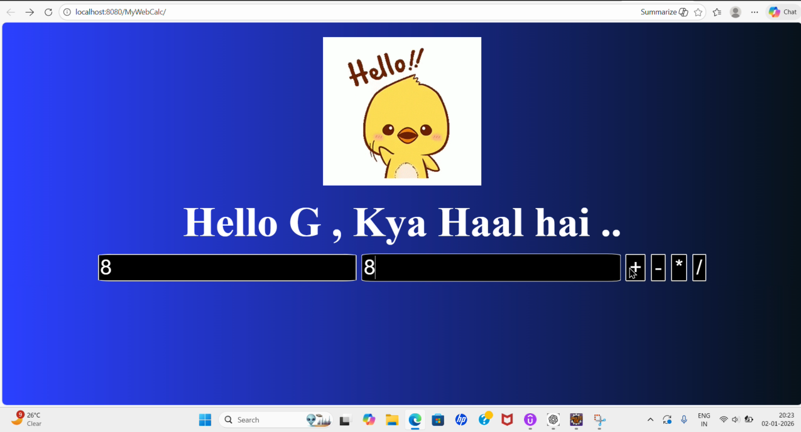
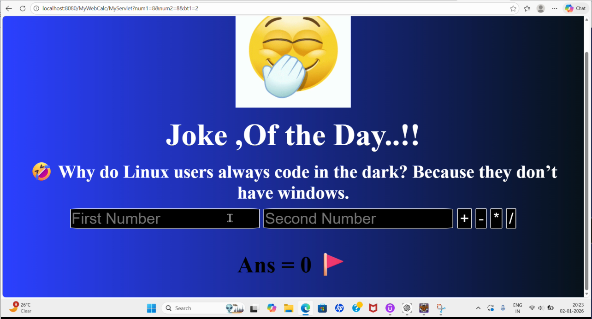

# 🧮 Java Calculator Web Application

A simple **Java web application** built using **Servlets and JSP**.  
The application performs basic arithmetic operations and displays a **random programming joke** with each calculation.

---

## 🚀 Features

- Addition, Subtraction, Multiplication, Division  
- Server-side processing using Java Servlet  
- Dynamic result display using JSP  
- Random programming joke on every calculation  
- Clean MVC-based structure  

---

## 🛠️ Tech Stack

- Java (JDK 8+)
- Jakarta Servlets
- JSP (Expression Language)
- HTML5, CSS3
- Apache Tomcat
- Eclipse IDE

---

## 📂 Project Structure

```
MyWebCalc/
│
├── src/
│   └── MyPackage/
│       └── MyServlet.java
│
├── WebContent/
│   ├── index.html
│   ├── result.jsp
│   ├── images/
│   │   ├── gif1.gif
│   │   └── gif2.gif
│   └── WEB-INF/
│
└── README.md
```

---

## ⚙️ Application Flow

1. User enters two numbers and selects an operation  
2. Request is sent to the Servlet  
3. Servlet performs calculation and selects a random joke  
4. Data is passed using request attributes  
5. JSP displays the result and joke  

---

## 🧩 Key Concepts Used

- MVC Architecture (Servlet → JSP)
- `RequestDispatcher.forward()`  
- Request attributes  
- JSP Expression Language (`${}`)  

---

## 🖥️ Screenshots

### Calculator Input Page


### Result Page


---

## ▶️ How to Run

```bash
git clone https://github.com/anshumalapandit/java-servlet-jsp-project.git
```

1. Import the project into **Eclipse**
2. Configure **Apache Tomcat**
3. Run the project on the server
4. Open in browser:
```
http://localhost:8080/MyWebCalc
```

---

## 📌 Learning Outcomes

- Understanding of Servlet lifecycle and request handling  
- Difference between `forward()` and `sendRedirect()`  
- Proper use of request attributes and JSP EL  
- Hands-on experience with Java web applications  

---

## 👩‍💻 Author

**Anshumala Pandit**  
Computer Science Engineering Student  

---

## ⭐ Feedback

If you found this project helpful, feel free to give it a ⭐ on GitHub.

